# Technical Appendix
The following sections are selected extracts from the book, _My Visit With Our Nucleonic Friends,_ by Pierre Caraot Niven, Ballantine Interplanetary, New York, Earth and Washington, Mars (2053). This is the only book to win the Nobel, Pulitzer, Hugo, Nebula, and Moebius prizes in the same year (2053).

## DRAGON'S EGG
The home star of the cheela was given the picturesque name Dragon's Egg by the humans because it is a star right-at the end of the constellation Draco (the Dragon), as if the Dragon had left an egg behind in its nest. The cheela coincidently also called their home Egg because it is the source of lifegiving heat and light, and glows warmly like the eggs they lay.

Egg, like most neutron stars, rotates rapidly because it is a small, compact body and only 20 kilometers in diameter that condensed from a large, slowly rotating red giant star many millions of kilometers across. Most of the mass, magnetic field, and angular momentum of the original star ended up in the neutron star. Dragon's Egg has a surface gravity of 67 billion Earth gravities, a magnetic field at the poles of a trillion gauss, and a rotation rate of 5.0183495 revolutions per second. Thus, one turn of Egg is roughly one-millionth of an Earth day. This approximate million-to-one relative time scale also seems to apply to the cheela life processes. Our nucleonic friends think, talk, live, and die a million times faster than we humans.

## RELATIVE TIME SCALES
The cheela use a base twelve numbering system since they have twelve eyes. The cheela units of time are given in the following table, along with the roughly equivalent time span for humans, taking into account the average lifetime of the cheela compared to the average lifetime of a human.

| Human Time | Cheela Time               | Remarks                  |
|------------|---------------------------|--------------------------|
| 1 day      | 3,000 g                   | 100 cheela generations   |
| 1 hour     | 126 g                     | 4 cheela generations     |
| 45 min     | 94 g                      | cheela lifetime          |
| 15 min     | 31 g                      | cheela generation        |
| 29 sec     | 1 g = 1 great = 144 turns | (equiv. to human year)   |
| 0.2 sec    | 1 t = 1 turn of Egg       | (equiv. to human day)    |
| 17 msec    | 1/12 t = dothturn         | (equiv. to human hour)   |
| 1.4 msec   | 1/144 t = grethturn       | (equiv. to human 10 min) |
| 115 msec   | 1/1728 t = methturn       | (equiv. to human minute) |
| 10 msec    | 1/20736 t = sethturn      | (equiv. to human 4 sec)  |
| 800 nsec   | 1/28832 t = blink         | (equiv. to human blink)  |

## OUR NUCLEONIC FRIENDS
One can hardly imagine a more alien life form than a cheela. A typical cheela weighs the same as a typical human, about 70 kilograms; but the nuclei in the cheela body have lost their electron clouds, so the nuclei are condensed into a tiny body that is squashed by the high gravity and stretched by the high magnetic field into an oval pancake shape a half-centimeter in diameter and a half-millimeter high---a little larger than a sesame seed.

The body is tough and flexible, with a tread on the bottom like that of a slug. Unlike a slug, a cheela can move equally well in any direction. The cheela have twelve eyes spaced around their periphery, giving them 360-degree vision. The eyes are up on stalks like those of a slug, but because of the high gravity the stalk is thicker. The cheela see using the ultraviolet and soft X-rays emitted by the 8200-K glowing surface of Egg.

Despite their alien appearance, the cheela are not thought of as ugly, terrifying monsters. Instead, they have become our friends. One suspects that their small size may have something to do with it, as well as the fact that they cannot use anything on Earth, or even the Earth itself. Anything made out of normal matter would collapse at a touch from their ultra-dense nucleonic bodies.

## LIFE ON A NEUTRON STAR
Living on a neutron star is very different from living on the Earth, but our friends, the cheela, find it very pleasant. The very high gravity field of 67 billion times Earth gravity means that everything must be built low to the crust and very sturdy. The very high magnetic field of a trillion gauss tends to elongate objects along the magnetic field lines and makes it difficult to move things across the magnetic field lines. The two magnetic poles of Dragon's Egg are on opposite sides of the neutron star near the equator. They are called the "East" and "West" Poles. Midway between the two magnetic poles the magnetic field lines are parallel to the surface, and the cheela find it easy to move east and west but difficult to move north and south.

There are things lacking on a neutron star that we take for granted. There is no sun. The light and energy that keep us alive on Earth pour down from the Sun during the day, while at night it is dark and cold. Thus, most life-forms on Earth go to sleep at night. On Egg the light and energy that keep the cheela alive come upward from the crust. It is never dark, so the life-forms on Egg never developed sleep. They do not have a moon, so they have no months. They do not orbit a star, so they have no year. Their only natural unit of time is the rotation of the fixed stars in the sky. Thus, their equivalent of a day-night cycle is a turn of the star.

The cheela don't have lamps, candles, fireplaces, or flashlights, for there is no dark and no cold on the glowing surface of Egg. Even the inside of a cave is brightly illuminated by the glow from the walls. The cheela don't have hanging pictures, hinged doors or windows, leafed books, rooftops, or tops to anything usually, for the gravity is too high. They don't have airplanes, balloons, kites, whistles, fans, straws, perfume, lungs, or breath because there is no air. What atmosphere there is consists of a few electrons and ions of iron or other typical crustal nuclei. They don't have umbrellas, bathtubs, showers, or flush toilets because there is no rain nor are there streams, lakes, or oceans.

Life for a modern cheela is not drab. Although cheela do not wear cloth to cover their supple, elastic, and variable-shaped bodies, they do dress up. Even uncivilized cheela wear body paint to cover their nakedness, and the modern fluorescent, liquid crystal, and variable-emittance paints make the city streets bright with color and patterns in the pre-turnfeast rush. Civilized cheela also never leave their compounds without first inserting into the holding sphincters in their hide a set of six badges that indicate their profession and their rank in that profession. For more festive occasions, jewelry can replace or augment the badges on the hide, while jewel-rings encircle each of their twelve eye-stubs.

A corner of a typical cheela home compound is shown in Figure 1. There are paintings on the wall, but they are painted right on the wall. There are books, but they are rolled up scrolls that are stored in scroll-walls. There are soft pads and pillows, but they are for resting and reading, not sleeping, for cheela don't sleep. There are windows, but they have no glass, for there is no cold or hot air to keep out. If a cheela wishes privacy, he pulls the horizontally sliding window blind shut. There is a door to the compound, which also slides in a track. Although modern cheela now use nuclear-power chronometers to keep track of time, the old-fashioned pendulum clock works as well on Egg as it does on earth, provided a sturdy frame is made to hold the pendulum in the strong gravity. On Earth, a one-meter pendulum ticks a slow once a second, whereas on Egg a one-millimeter pendulum ticks a fast three times a blink. On the right is one of the favorite pets of the cheela, a longhaired Slink.

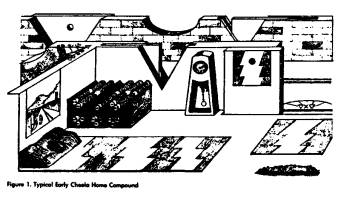

Since cheela are egg-layers that leave their eggs at the hatching pens of their clan, they do not form family units, and each cheela lives alone with its pets. Most cheela choose a Slink for their pet. There are as many different breeds of Slinks on Egg as there are different breeds of dogs on Earth, and apparently for the same reasons.

A typical mongrel Slink is a small hairy animal with an oval shape, an undertread for moving, and twelve eyes up on stalks. Although most cheela don't admit it to themselves, except for the hair and the significantly lower intelligence, a Slink looks and behaves much like a young cheela hatchling. On Earth, it would be as if the most popular pets were monkeys rather than cats or dogs.

Cheela bodies are very wide compared to their height so they take up a lot of area. To accommodate these wide bodies without the aid of basements or multiple stories, the home and workplace compounds also take up a lot of area, so the walls go right out to the street as they do in old towns on Earth.

An architect's version of a typical cheela street in the town of Swift's Climb is shown in Figure 2. The East Pole mountains can be seen in the distance, while to the right rise the South Side cliffs marking the South Side fault line. The main street is east-west, with compounds in each side abutting the slidewalks. Near the East Pole, the magnetic field comes up out of the ground so all directions are hard-going, and the cross streets are at right angles to each other. In cities far from the poles, such as the capital, Bright's Heaven, the "cross" streets are at an angle of thirty to sixty degrees to the easygoing east-west streets. When moving along these cross streets the cheela brace their bodies against the slippery slidewalls and push their way at an angle to the prevailing magnetic field to get to the next east-west street where the rippling is easier.

The cheela learned about traffic problems from the humans long before they had cities big enough to have traffic problems. The street, with its double yellow line down the middle, is ready for the turnfeast glide-car rush.

Each compound usually takes up a separate block to itself. (In Bright's Heaven, the "blocks" are diamond- or triangle-shaped.) The street name markers are built up from the corners of the compound walls, while the entrances to the compounds are identified with street numbers in the wall and the name of the owner in the slidewalk plate. The home compound on the left is a modern version with half-circle window cutouts and an inner walled patio area with a tri-poster tree. The home compound on the right is an older version with simple square windows and no inner patio.

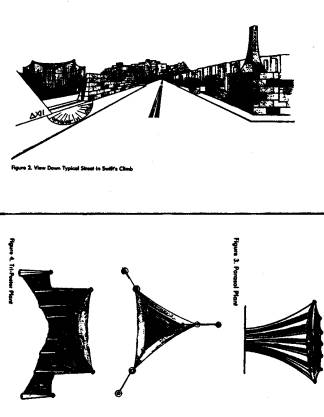

## PLANT LIFE ON EGG
The plants on Egg make food by extracting energy from the hot crust of Egg with their root system and rejecting their waste heat to the cold temperature of the sky. One major form of plant life is the parasol or petal-pod plant shown in Figure 3. It has a single taproot buried deep in the crust. From the single root grow twelve strong, curving compression members or "trunks," tied together with tension threads to a central post. Between each trunk and across the top of the plant is stretched a membrane "skin." The top membrane, facing the cold sky, is highly emissive and dark. At the end of each of the twelve trunks are the pollen shooters and collectors.

The cheela evolved from the parasol plant and still contain the genetic code for the plant form in their genes. Under proper manipulation of their "hormone" balance, they become immobile, dissolve their internal muscles, and re-form into a very large version of the parasol plant called a dragon plant.

Upon reversal of the process, they regrow a new, young cheela body to house their brain and nervous system, which had been unaffected by the transformation. This animal-plant-animal process gives the cheela a method for rejuvenation of the body.

Another form of plant life is the tri-poster plant shown in Figure 4. It puts out secondary trunks like the banyan tree on Earth, then grows an interconnected triple trunk system with membranes and tension fibers completing the structure.

A third form of plant life is the cleft-wort, well-known trademark of the Web Construction Company. It is found mostly in crevices in rocks in the mountainous areas at the east and west magnetic poles, although the hardy mountain plant also thrives in the nooks and crannies of the homes and offices in the cities and towns. As can be seen in Figure 5, the cleft-wort plant uses the rocks and ledges to provide mechanical support. A taproot at the base of the cleft climbs up the corner of the crevice to the upper surface where it attaches onto opposite sides of the cleft with broad surface roots. The surface roots then anchor tension fibers in a pattern similar to that of a spider web in the corner of a room. The web fibers support a membrane between them. The upper surface of the membrane is highly emissive to allow waste heat to escape to the cold sky, while the lower surface is silvery to reflect the heat from the hot crust below.

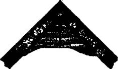
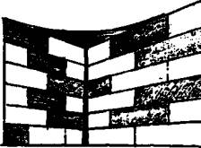
##### Figure 5. Cleft-Wort Plant

## STARQUAKES
The only "weather" the cheela have on the nearly airless Egg is earthquakes or, more properly, crustquakes or starquakes, depending upon the magnitude. While a large quake on Earth has a Richter magnitude of 8 or greater, large starquakes on neutron stars can reach an equivalent Richter magnitude of 16!

Having experienced a starquake at close quarters with a number of different instruments active and measuring, we now have a better idea of what a large starquake is like. Our present understanding is summarized in a recently published book by some of the crew members on Dragon Slayer.[^1] Our findings are not significantly different than the older publications in the field that discussed how the vibrational energy in the crust gets transferred into the magnetic field and then into the electrons and ions in the sparse atmosphere[^2] [^3], how the smaller quakes can be used to predict the largest quakes,[^4] and how a large quake can trigger a core collapse or starquake. Unfortunately, being able to predict a large quake from smaller quakes was of little help to us humans who were there. The whole quake sequence takes place in less than a second.

## ULTRADENSE MACHINERY
Being ultra-dense themselves and living on an ultra-dense world, the cheela have developed a technology of ultra-dense machines that is way beyond our present understanding, although Einstein and others have given us some clues. Of course, even to approach Dragon's Egg with our spacecraft, Dragon Slayer, we humans had to construct some simple ultra-dense machines ourselves.

Figure 6 shows the basic problem of getting to know a neutron star better. If our spacecraft is in orbit at an altitude h above a neutron star of mass _M_ and radius _R,_ then only the center of the spacecraft is in free fall. The rest of the objects in the spacecraft (like the crew) are subjected to tidal forces.

The amount of tidal acceleration _a_ each crew member is subjected to is proportional to the distance _l_ from the center of mass of the spacecraft.

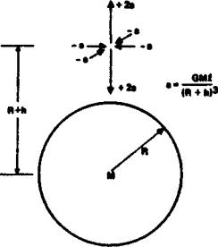
##### Figure 6. Tidal Acceleration Above a Mass

We wanted Dragon Slayer at a 406-kilometer altitude above Egg so it would be in a synchronous orbit about the star (with the orbital period equal to the rotation period of the star). At this distance from a neutron star, even though the orbital motion cancels the gravity attraction at the center of the spacecraft, the acceleration due to the tidal effects is 200 Earth gravities per meter outward in the radial direction to the neutron star and 100 gravities per meter inward in a plane tangent to the star.

To counteract these tides the crew of St. George constructed a tidal compensator made of six ultra-dense masses arranged in a ring around the spacecraft. As can be seen in Figure 7, the tides in the middle of a ring of masses have a tidal pattern that is exactly opposite to that of the tides above a single mass. By adjusting the mass _m_ and spacing _r_ of the ring masses, we were able to compensate the tides of the neutron star and get close enough to the star to collect good scientific data.

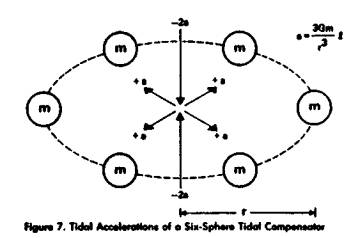

Later, when the cheela wanted to shrink the ring of masses, the tides from the compensator masses became stronger than the tides from the neutron star and it was necessary to "augment" the neutron star tides to keep the combined tides near zero. As is shown in Figure 8, this was done with a two-mass tidal augmentor. This mass configuration gives no net gravity force at the point between them, so the orbital parameters of the object between the masses are not changed, but the accelerations at points away from the zero-force point increase in exactly the same way as the tidal accelerations above a single mass. A full explanation of tidal forces and how they can be compensated and augmented by arrangements of dense spheres can be found in an old paper on producing picogravity regions near the Earth.[^5]

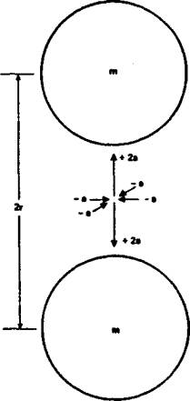
##### Figure 8. Tidal Accelerations of a Two-Sphere Tidal Augmentor

The tidal forces of a neutron star, and the compensators and augmentors needed to cope with them, could have been understood by Newton, although he would have been amazed that such ultra-dense stars and machines could exist. The cheela have ultra-dense machines that are even more amazing. We know that the cheela machines use technology that goes beyond the Einstein theory of gravity, especially at the ultra-high densities, fields, and velocities that the highly advanced cheela are able to generate.

The secrets to the fabrication of the ultra-dense machines of the cheela are still locked up behind their cryptographic code in the HoloMem Crystals at the Smithsonian Museum. However, just as Newton's laws of gravity are still valid at low mass densities, Einstein's laws of gravity are still valid at high mass densities, and they can be used to give clues as to what might happen in the ultra-high density regions where the Einstein laws fail.

The cheela had a time machine that allowed messages to be sent backward and forward in time. The Einstein General Theory of Relativity can be used to show how such a machine might be built, despite the paradoxes that such a machine would bring if it _were_ built. As is shown in Figure 9, if a long, ultra-dense cylinder is somehow rotated about its long axis until the peripheral velocity of the cylinder is greater than half the speed of light, then a simple analysis[^6] shows that there should be a region near the middle of the cylinder, but outside the surface of the cylinder, where space and time are mixed up. By choosing a proper trajectory, an object or photon can be sent circling around the cylinder with or against the spin of the cylinder to emerge either in the past or the future. How the cheela managed to make a spinning ultra-dense cylinder and keep it elongated long enough to send messages is unknown.

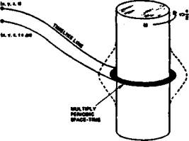
##### Figure 9. Two-way Time Machine

The workhorse of early cheela space transportation was a gravity catapult. We are not sure exactly how it works, but again the Einstein General Theory of Relativity gives us a clue. It has been shown[^7] [^8] that the Einstein theory of gravity has a number of similarities to the Maxwell theory of electromagnetism. In electromagnetism, the basic source of all the forces is the charge on the electron. The charge generates an electric field. If you move the charge to form an electric current, the current generates a magnetic field. It is also known that if you increase or decrease a magnetic field, that changing magnetic field in turn generates an electric field.

The same thing happens in gravity. The basic source of all the forces is the mass of whatever particles you are using. The mass generates a gravity field. If you move the particles to form a mass current, the current generates a new field that is the gravitational equivalent of the magnetic field. In Figure 10 we show a torus wrapped with tubing carrying a mass current _T_ and generating the new field _P_ called the protational or Lense-Thirring field. If you increase or decrease the protational field, it will generate a gravity field G at the center of the catapult that will push any object at the center of the ring in an upward direction. The cheela gravity catapults must work in somewhat the same manner, but it is also obvious that new physics must be involved. The Einstein theory would predict that a machine using neutron star density material could not make a strong enough gravity field to catapult a spacecraft off Egg.

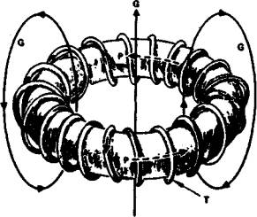
##### Figure 10. Gravity Catapult

The most amazing ultra-dense machine the cheela constructed was a miniature space-warp. The Einstein General Theory of Relativity can give us a clue to its formation, but only a clue, since the size of the space-warp that they made was much larger than what the Einstein theory would have predicted. There is a relatively simple exact solution to the full Einstein field equations that describes the exterior field of a dense spinning mass. It is called the Kerr metric solution.

If you assume that the spinning mass is in the form of an ultra-dense ring as is shown in Figure 11, with mass _M_ and electric or magnetic charge _Q,_ then using the Kerr metric, it can be shown[^9] [^10] that _if_ the spinning ring is dense enough and spinning rapidly enough, it acts like a space-warp and a time machine combined. When a small object is sent through the center of the ring, it does not come out the other side!

Instead, the mathematics predicts that the object enters a hy-perspace where time and space have been interchanged. If the object is moved with or against the spin of the ring, it is moved backward or forward in time. To return to our universe, the object is merely moved back through the hole in the ring once again. Such a rapidly rotating ultra-dense ring is obviously unstable and it took all the advanced technology of the cheela to keep the ring stable long enough to attempt a rescue.

##### NORMAL SPACE
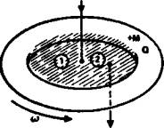
##### HYPERSPACE
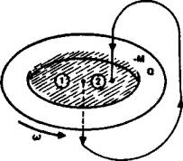
##### Figure 11. Kerr Metric Space Warp

## REFERENCES

[^1]: S. K. Takahashi, J. K. Thomas, and P. C. Niven, _Neutron Star Dynamics,_ McGraw-Hill (2053).

[^2]: R. Ramaty et al., "Origin of the 5 March 1979 Gamma-Ray Transient: A Vibrating Neutron Star," _Nature_ **287,** 122 (11 Sept 1980).

[^3]: E. P. T. Liang, "Inverse Comptonization and the Nature of the March 1979 Gamma-Ray Burst Event," _Nature_ **292,** 319 (23 July 1981).

[^4]: V. Trimble, "A Successful Glitch-Hunt," _Nature_ **353,** 666 (31 Oct 1991).

[^5]: R. L. Forward, "Flattening Spacetime near the Earth," _Phys. Rev._ **D26,* 735 (1982).

[^6]: F. J. Tipler, "Rotating Cylinders and the Possibility of Global Causality Violation," _Phys. Rev._ **D9,** 2203 (1974).

[^7]: R. L. Forward, "General Relativity for the Experimentalist," _Proc. IRE_ (now _Proc. IEEE)_ **49,** 1442 (1961).

[^8]: R. L. Forward, "Guidelines to Antigravity," _Am. J. Physics_ **31,** 166 (1963).

[^9]: B. Carter, "Complete Analytic Extension of the Symmetry Axis of Kerr's Solution of Einstein's Equations," _Phys. Rev._ **141,** 1242 (1966).

[^10]: B. Carter, "Global Structure of the Kerr Family of Gravitational Fields," _Phys. Rev._ **174,** 1559 (1968).